# RAG with Long-Term Memory

A Retrieval-Augmented Generation system with persistent long-term memory capabilities, enabling contextual conversations that remember past interactions and build knowledge over time.

## 🎬 Demo & Screenshots

### Key Features in Action

#### 📤 Document Upload & Indexing
Upload documents (PDF, TXT, MD) through the web interface. Files are automatically:
- Saved to `data/documents/` folder
- Processed and indexed for retrieval
- Available for immediate querying

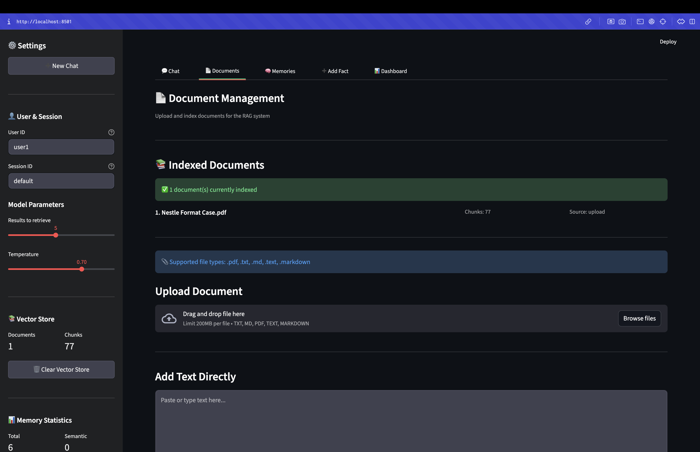

#### 💬 Conversational Interface
Chat with your documents using natural language. The system combines:
- Document retrieval from uploaded files
- Memory retrieval from past conversations
- LLM generation with full context

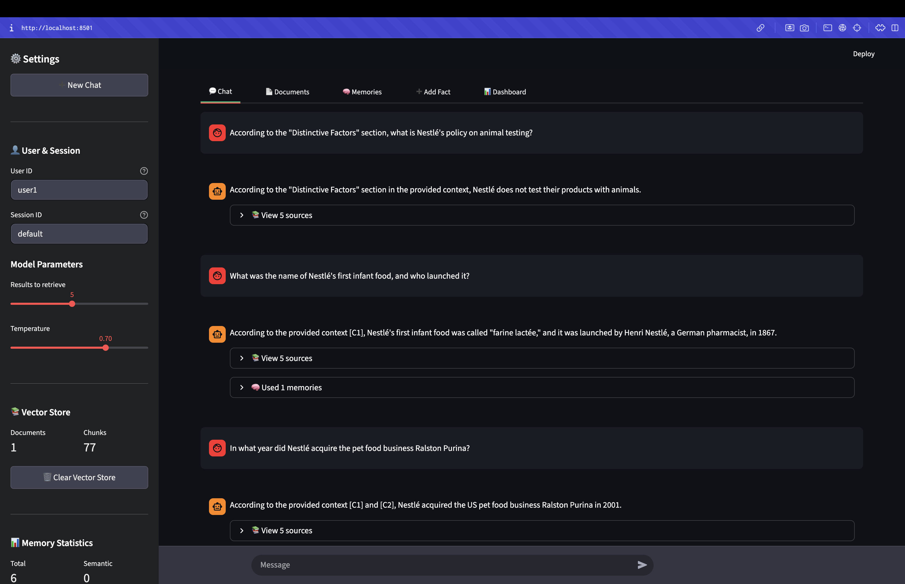

#### 🧠 Memory Management
View and manage long-term memories:
- Track episodic (conversations), semantic (facts), and procedural (how-to) memories
- Monitor memory importance and strength
- See memory decay over time
- Filter by memory type and session

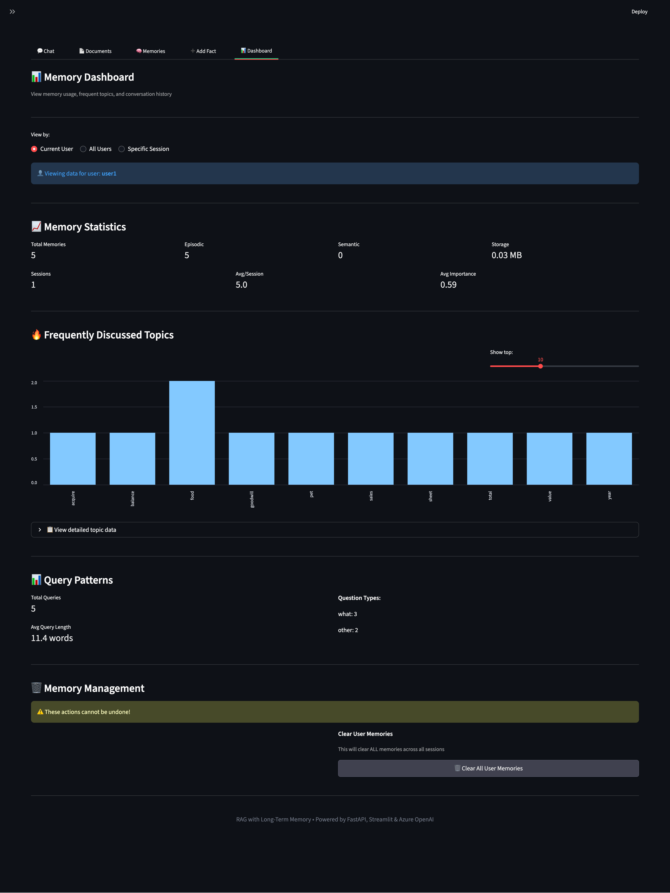

#### 📊 Analytics & Insights
Monitor system performance and memory usage:
- Memory statistics by type
- Access patterns and frequency
- Retrieval performance metrics
- Session-based analytics

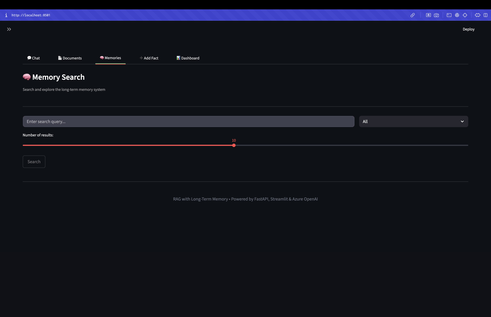

## Architecture Overview

The system combines traditional RAG (Retrieval-Augmented Generation) with a sophisticated long-term memory system that persists knowledge across sessions.

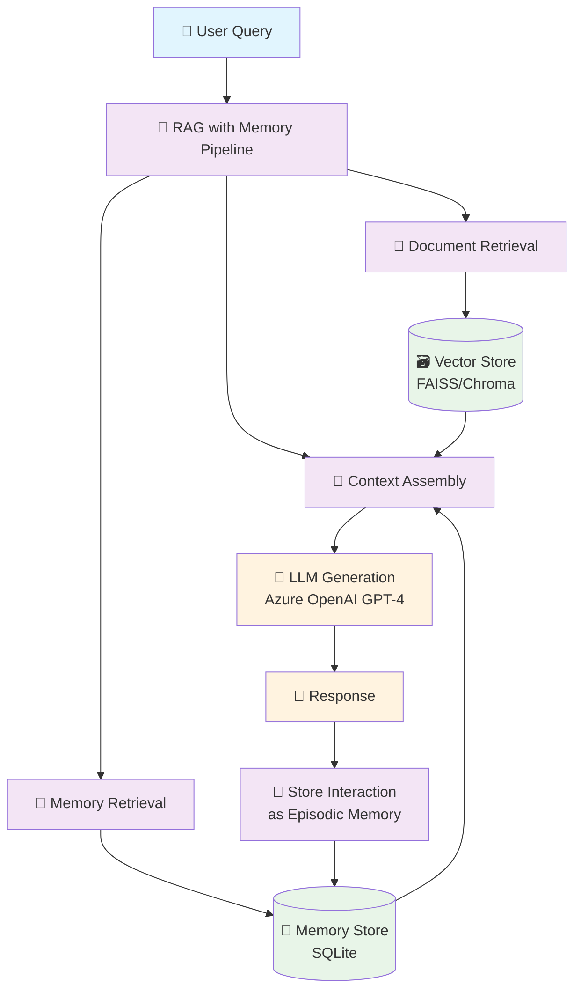
```mermaid
graph TB
    User[👤 User Query] --> Pipeline[🧠 RAG with Memory Pipeline]
    
    Pipeline --> DocRet[📄 Document Retrieval]
    Pipeline --> MemRet[🧠 Memory Retrieval]
    Pipeline --> Context[📝 Context Assembly]
    
    DocRet --> VectorDB[(🗃️ Vector Store<br/>FAISS/Chroma)]
    MemRet --> MemoryDB[(💾 Memory Store<br/>SQLite)]
     
    VectorDB --> Context
    MemoryDB --> Context
    
    Context --> LLM[🤖 LLM Generation<br/>Azure OpenAI GPT-4]
    LLM --> Response[💬 Response]
    
    Response --> MemStore[💾 Store Interaction<br/>as Episodic Memory]
    MemStore --> MemoryDB
    
    classDef userNode fill:#e1f5fe
    classDef processNode fill:#f3e5f5
    classDef storageNode fill:#e8f5e8
    classDef llmNode fill:#fff3e0
    
    class User userNode
    class Pipeline,DocRet,MemRet,Context,MemStore processNode
    class VectorDB,MemoryDB storageNode
    class LLM,Response llmNode
```

## Memory System Architecture

The long-term memory system is designed around three types of memory, inspired by cognitive science:

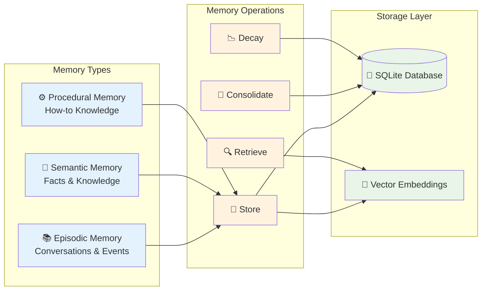
```mermaid
graph LR
    subgraph "Memory Types"
        Episodic[📚 Episodic Memory<br/>Conversations & Events]
        Semantic[🧠 Semantic Memory<br/>Facts & Knowledge]
        Procedural[⚙️ Procedural Memory<br/>How-to Knowledge]
    end
    
    subgraph "Storage Layer"
        SQLite[(💾 SQLite Database)]
        Embeddings[🔢 Vector Embeddings]
    end
    
    subgraph "Memory Operations"
        Store[💾 Store]
        Retrieve[🔍 Retrieve]
        Consolidate[🔄 Consolidate]
        Decay[📉 Decay]
    end
    
    Episodic --> Store
    Semantic --> Store
    Procedural --> Store
    
    Store --> SQLite
    Store --> Embeddings
    
    Retrieve --> Embeddings
    Consolidate --> SQLite
    Decay --> SQLite
    
    classDef memoryType fill:#e3f2fd
    classDef storage fill:#e8f5e8
    classDef operation fill:#fff3e0
    
    class Episodic,Semantic,Procedural memoryType
    class SQLite,Embeddings storage
    class Store,Retrieve,Consolidate,Decay operation
```

## Detailed System Flow

Here's how a query flows through the entire system:

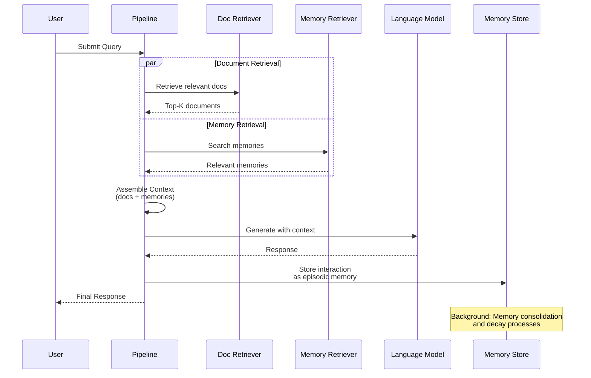
```mermaid
sequenceDiagram
    participant U as User
    participant P as Pipeline
    participant DR as Doc Retriever
    participant MR as Memory Retriever
    participant LLM as Language Model
    participant MS as Memory Store
    
    U->>P: Submit Query
    
    par Document Retrieval
        P->>DR: Retrieve relevant docs
        DR-->>P: Top-K documents
    and Memory Retrieval
        P->>MR: Search memories
        MR-->>P: Relevant memories
    end
    
    P->>P: Assemble Context<br/>(docs + memories)
    P->>LLM: Generate with context
    LLM-->>P: Response
    
    P->>MS: Store interaction<br/>as episodic memory
    P-->>U: Final Response
    
    Note over MS: Background: Memory consolidation<br/>and decay processes
```

## Features

- **🔍 Hybrid Retrieval**: Vector-based document retrieval using FAISS/Chroma combined with semantic memory search
- **🧠 Long-Term Memory**: Persistent memory with three types (episodic, semantic, procedural)
- **⚖️ Importance Scoring**: Automatic assessment of memory importance for selective storage
- **📉 Memory Decay**: Natural forgetting process with consolidation of important memories
- **🤖 LLM Integration**: Azure OpenAI GPT-4 with memory-enhanced prompts
- **🚀 FastAPI Backend**: RESTful API for integration
- **🎨 Streamlit Interface**: User-friendly web interface
- **📊 Memory Analytics**: Statistics and insights into memory usage
- **💾 Document Storage**: Uploaded documents are automatically saved to `data/documents/` folder for persistent storage and reference

## Quick Start

### Prerequisites
- Python 3.8+
- Azure OpenAI API key
- At least 4GB RAM (for embeddings and vector operations)

### Installation

1. **Clone and Setup Environment**
   ```bash
   git clone <repository-url>
   cd rag_ltm
   python -m venv venv
   source venv/bin/activate  # On Windows: venv\Scripts\activate
   pip install -r requirements.txt
   ```

2. **Configure API Keys**
   ```bash
   cp .env.example .env
   # Edit .env with your Azure OpenAI credentials:
   # AZURE_OPENAI_API_KEY=your_api_key_here
   # AZURE_OPENAI_ENDPOINT=your_endpoint_here
   ```

3. **Initialize System**
   ```bash
   # Setup directories and initialize databases
   chmod +x setup.sh
   ./setup.sh
   ```

4. **Run the System**
   ```bash
   # Option 1: Run both API and UI
   chmod +x run.sh
   ./run.sh
   
   # Option 2: Run separately
   # Terminal 1 - API Server
   uvicorn src.api.main:app --reload --port 8000
   
   # Terminal 2 - Streamlit UI
   streamlit run src.ui/streamlit_app.py --server.port 8501
   ```

5. **Access the Interface**
   - Web UI: http://localhost:8501
   - API Documentation: http://localhost:8000/docs
   - API Health Check: http://localhost:8000/health

## 📖 Step-by-Step Tutorial

### First Time Setup

```bash
# 1. Clone the repository
git clone <repository-url>
cd rag_ltm

# 2. Create virtual environment
python -m venv venv
source venv/bin/activate  # Windows: venv\Scripts\activate

# 3. Install dependencies
pip install -r requirements.txt

# 4. Configure environment
cp .env.example .env
# Edit .env with your Azure OpenAI credentials

# 5. Run setup
chmod +x setup.sh
./setup.sh

# 6. Start the system
chmod +x run.sh
./run.sh
```

### Your First Query

1. **Upload a Document** (via Web UI or API)
   ```bash
   curl -X POST http://localhost:8000/documents/upload \
     -F "file=@my_document.pdf"
   ```

2. **Ask a Question**
   ```bash
   curl -X POST http://localhost:8000/query \
     -H "Content-Type: application/json" \
     -d '{
       "query": "What is this document about?",
       "session_id": "my_first_session",
       "user_id": "me"
     }'
   ```

3. **Check Memory** - Your interaction is now stored!
   ```bash
   curl http://localhost:8000/memory/stats
   ```

4. **Ask a Follow-up** - Uses memory from previous conversation
   ```bash
   curl -X POST http://localhost:8000/query \
     -H "Content-Type: application/json" \
     -d '{
       "query": "Tell me more about what we just discussed",
       "session_id": "my_first_session",
       "user_id": "me"
     }'
   ```

### Understanding the Response

When you query the system, you get a comprehensive response:

```json
{
  "answer": "The detailed answer to your question...",
  
  "sources": [
    // Documents retrieved from vector store
    {
      "id": 1,
      "content": "Relevant excerpt from uploaded documents",
      "score": 0.89,  // Similarity score
      "metadata": {"filename": "document.pdf"}
    }
  ],
  
  "memories_used": [
    // Relevant past interactions and facts
    {
      "content": "Q: Previous question\nA: Previous answer",
      "type": "episodic",
      "importance": 0.7,
      "strength": 0.85,
      "access_count": 3
    }
  ],
  
  "tokens_used": 245,           // LLM tokens consumed
  "retrieval_time": 0.123,      // Time to retrieve docs/memories
  "generation_time": 1.456,     // Time for LLM generation
  "total_time": 1.579,          // Total processing time
  
  "metadata": {
    "num_sources": 5,           // Documents found
    "num_memories": 2,          // Memories used
    "session_id": "my_first_session",
    "user_id": "me"
  }
}
```

## Usage Examples

### 🚀 Quick Start with API

#### 1. Upload a Document
```bash
# Upload a PDF document
curl -X POST http://localhost:8000/documents/upload \
  -F "file=@/path/to/document.pdf"

# Response:
{
  "status": "success",
  "filename": "document.pdf",
  "file_path": "/data/documents/document.pdf",
  "size": 15234,
  "processing_time": 0.234,
  "indexing_time": 1.456
}
```

#### 2. Query with Memory
```bash
# First query - establishes context
curl -X POST http://localhost:8000/query \
  -H "Content-Type: application/json" \
  -d '{
    "query": "What is RAG?",
    "session_id": "user_123",
    "user_id": "john_doe"
  }'

# Follow-up query - uses memory
curl -X POST http://localhost:8000/query \
  -H "Content-Type: application/json" \
  -d '{
    "query": "How does it differ from traditional search?",
    "session_id": "user_123",
    "user_id": "john_doe"
  }'

# Response includes context from previous conversation
{
  "answer": "RAG, which we discussed earlier, differs from traditional search...",
  "memories_used": [
    {
      "content": "Q: What is RAG?\nA: Retrieval-Augmented Generation...",
      "type": "episodic",
      "importance": 0.6
    }
  ],
  "sources": [...],
  "tokens_used": 245
}
```

#### 3. Add Important Facts
```bash
# Store a semantic fact
curl -X POST http://localhost:8000/memory/fact \
  -H "Content-Type: application/json" \
  -d '{
    "fact": "The production API has a rate limit of 1000 requests/hour",
    "importance": 0.9,
    "tags": ["api", "production", "limits"]
  }'
```

#### 4. Check Memory Statistics
```bash
# Get memory stats
curl http://localhost:8000/memory/stats

# Response:
{
  "total_memories": 150,
  "episodic_memories": 100,
  "semantic_memories": 50,
  "average_importance": 0.65,
  "average_strength": 0.78
}
```

#### 5. Session Management
```bash
# List all sessions
curl http://localhost:8000/sessions

# Get session timeline
curl http://localhost:8000/sessions/user_123/timeline

# Get user's frequent topics
curl http://localhost:8000/users/john_doe/frequent-topics?top_n=10
```

### 🐍 Python SDK Examples

#### Basic Conversation with Memory

```python
from src.pipeline.rag_with_memory import RAGWithMemory
from src.memory.long_term_memory import LongTermMemory

# Initialize the system
pipeline = RAGWithMemory(...)

# First interaction
response1 = pipeline.query(
    "I'm working on a Python web scraping project using BeautifulSoup",
    session_id="user_123"
)

# Later interaction - system remembers context
response2 = pipeline.query(
    "What was I working on earlier?",
    session_id="user_123"
)
# Response will reference the web scraping project from memory
```

### Uploading Documents

```python
# Upload a document via API
import requests

with open("my_document.pdf", "rb") as f:
    files = {"file": ("my_document.pdf", f, "application/pdf")}
    response = requests.post("http://localhost:8000/documents/upload", files=files)

result = response.json()
print(f"File saved to: {result['file_path']}")
print(f"Processing time: {result['processing_time']}s")
print(f"Indexing time: {result['indexing_time']}s")

# Supported file types: .pdf, .txt, .md
```

### Adding Important Facts

```python
# Store important information that should be remembered
pipeline.add_fact(
    fact="The production API rate limit is 1000 requests per hour",
    importance=0.9,
    tags=["api", "production", "rate-limit"]
)

# Later queries about APIs will retrieve this fact
response = pipeline.query("What's the API rate limit?")
```

### Memory Statistics

```python
# Check memory system health
stats = pipeline.get_memory_stats()
print(f"Total memories: {stats['total_memories']}")
print(f"Average importance: {stats['average_importance']:.2f}")
```

## Memory System Features

### 🧠 Three Types of Memory

| Type | Purpose | Examples | Retention |
|------|---------|----------|-----------|
| **Episodic** | Conversations & Events | "User asked about caching yesterday" | Session-based, decays |
| **Semantic** | Facts & Knowledge | "User prefers tabs over spaces" | Long-term, high importance |
| **Procedural** | How-to Knowledge | "Steps for deployment process" | Workflow-based |

### 📊 Importance Scoring

The system automatically calculates importance based on:
- **Content Analysis**: Keywords like "important", "remember", "always"
- **User Signals**: Explicitly marked information
- **Context**: Source type and metadata
- **Length**: Detailed content vs. brief mentions

### 🔄 Memory Decay & Consolidation

The system implements automatic memory decay to simulate natural forgetting:

- **Time-Based Decay**: Memory strength decreases over time when not accessed
  - Decay rate: 1% per day (configurable via `decay_rate` in config.yaml)
  - Formula: `decay = decay_rate × days_elapsed × (1 - importance × 0.5)`
  
- **Importance Protection**: High-importance memories decay slower
  - Protection factor = importance × 0.5
  - Example: A memory with 0.9 importance decays ~50% slower than one with 0.3 importance
  
- **Automatic Application**: Decay is applied automatically when memories are retrieved
  - Updates access timestamp and count
  - Recalculates and updates strength
  - No manual intervention needed
  
- **Minimum Threshold**: Memories are clamped to minimum strength of 0.1
  - Memories below `min_strength` threshold are filtered out during retrieval
  
- **Batch Consolidation**: Optional manual decay application via `apply_decay_to_all_memories()`
  - Useful for periodic maintenance
  - Available via API endpoint: `POST /memory/decay`

**Decay Examples (after 30 days):**

| Importance | Original Strength | New Strength | Decay % |
|------------|------------------|--------------|---------|
| 0.3 (low)  | 1.0              | 0.745        | 25.5%   |
| 0.6 (med)  | 1.0              | 0.790        | 21.0%   |
| 0.9 (high) | 1.0              | 0.835        | 16.5%   |

### 🔍 Smart Retrieval

- **Semantic Search**: Uses vector embeddings for contextual matching
- **Multi-factor Ranking**: Combines similarity, importance, and recency
- **Type Filtering**: Can focus on specific memory types
- **Strength Threshold**: Ignores very weak/old memories

## 🎯 Feature Showcase

### 1. Multi-Session Context
```python
# User in Session 1
response = pipeline.query(
    "I'm building a REST API with FastAPI",
    session_id="session_1",
    user_id="developer_1"
)

# Later, in Session 2 (same user)
response = pipeline.query(
    "What framework was I using for my API?",
    session_id="session_2", 
    user_id="developer_1"
)
# Returns: "You were using FastAPI for your REST API"
# Memory retrieved across sessions for the same user
```

### 2. Document-Based Q&A with Memory
```python
# Upload technical documentation
pipeline.add_documents(
    texts=[pdf_content],
    doc_ids=["api_docs.pdf"],
    metadatas=[{"type": "documentation", "version": "2.0"}]
)

# Query combines doc retrieval + conversation memory
response = pipeline.query(
    "How do I implement rate limiting?",
    session_id="dev_session"
)
# Uses both: API docs + previous discussions about rate limiting
```

### 3. Importance-Based Memory Retention
```python
# High importance - long retention
pipeline.add_fact(
    fact="Production database credentials must never be committed to git",
    importance=0.95,  # Very important!
    tags=["security", "production", "critical"]
)

# Low importance - faster decay
pipeline.query(
    "The weather is nice today",
    session_id="casual_chat"
)
# Stored with lower importance, will decay faster
```

### 4. Memory Decay Simulation
```python
# Initial memory strength: 1.0
memory = pipeline.ltm.store_memory(
    content="User prefers tabs over spaces",
    memory_type=MemoryType.SEMANTIC,
    importance=0.6
)

# After 30 days without access
pipeline.ltm.apply_decay_to_all_memories()
# New strength ≈ 0.79 (21% decay)

# After 90 days
# New strength ≈ 0.37 (63% decay)

# High importance memories decay slower!
```

### 5. Session Analytics
```python
# Get conversation timeline
timeline = frequency_analyzer.get_conversation_timeline(
    session_id="dev_session",
    limit=20
)

# Get frequent topics
topics = frequency_analyzer.get_frequent_topics(
    user_id="developer_1",
    top_n=10
)

# Get query patterns
patterns = frequency_analyzer.get_query_patterns(
    session_id="dev_session"
)
```

### 6. Batch Memory Operations
```python
# Batch update for performance
updates = [
    (memory_id_1, new_strength_1),
    (memory_id_2, new_strength_2),
    (memory_id_3, new_strength_3)
]
pipeline.ltm.memory_store.batch_update_memory_access(updates)

# Much faster than individual updates!
```

## Long-Term Memory Components

### Memory Types & Structure

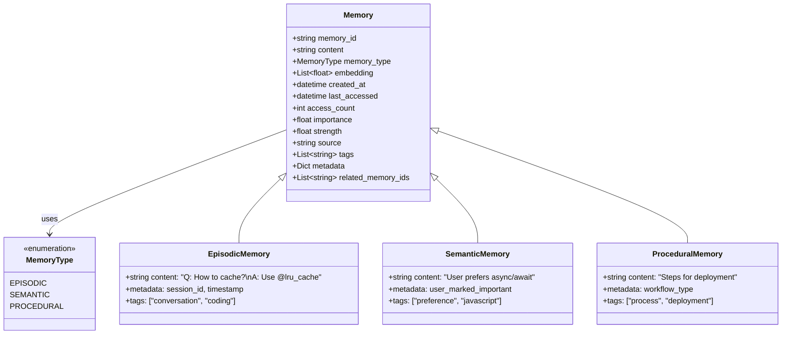
```mermaid
classDiagram
    class Memory {
        +string memory_id
        +string content
        +MemoryType memory_type
        +List~float~ embedding
        +datetime created_at
        +datetime last_accessed
        +int access_count
        +float importance
        +float strength
        +string source
        +List~string~ tags
        +Dict metadata
        +List~string~ related_memory_ids
    }
    
    class MemoryType {
        <<enumeration>>
        EPISODIC
        SEMANTIC
        PROCEDURAL
    }
    
    class EpisodicMemory {
        +string content: "Q: How to cache?\nA: Use @lru_cache"
        +metadata: session_id, timestamp
        +tags: ["conversation", "coding"]
    }
    
    class SemanticMemory {
        +string content: "User prefers async/await"
        +metadata: user_marked_important
        +tags: ["preference", "javascript"]
    }
    
    class ProceduralMemory {
        +string content: "Steps for deployment"
        +metadata: workflow_type
        +tags: ["process", "deployment"]
    }
    
    Memory --> MemoryType : uses
    Memory <|-- EpisodicMemory
    Memory <|-- SemanticMemory
    Memory <|-- ProceduralMemory
```

### Memory Lifecycle

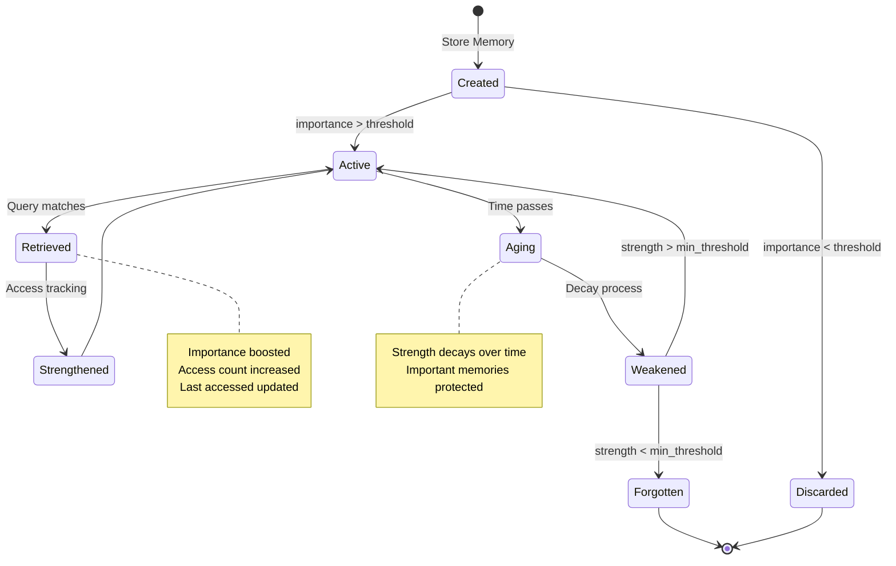
```mermaid
stateDiagram-v2
    [*] --> Created: Store Memory
    
    Created --> Active: importance > threshold
    Created --> Discarded: importance < threshold
    
    Active --> Retrieved: Query matches
    Active --> Aging: Time passes
    
    Retrieved --> Strengthened: Access tracking
    Aging --> Weakened: Decay process
    
    Strengthened --> Active
    Weakened --> Active: strength > min_threshold
    Weakened --> Forgotten: strength < min_threshold
    
    Forgotten --> [*]
    Discarded --> [*]
    
    note right of Retrieved
        Importance boosted
        Access count increased
        Last accessed updated
    end note
    
    note right of Aging
        Strength decays over time
        Important memories protected
    end note
```

## Project Structure

```
rag_ltm/
├── src/
│   ├── retrieval/          # Vector store and document retrieval
│   │   ├── chroma_store.py     # ChromaDB integration
│   │   ├── faiss_store.py      # FAISS vector store
│   │   ├── embeddings.py       # Text embedding generation
│   │   ├── document_processor.py # Document text extraction
│   │   └── retriever.py        # Document retrieval logic
│   ├── generation/         # LLM integration
│   │   ├── azure_openai_llm.py # Azure OpenAI wrapper
│   │   ├── llm_manager.py      # LLM orchestration
│   │   └── prompts.py          # Prompt templates
│   ├── memory/             # Long-term memory system ⭐
│   │   ├── memory_types.py     # Memory data models
│   │   ├── memory_store.py     # SQLite storage layer
│   │   ├── long_term_memory.py # Memory manager
│   │   └── importance_calculator.py # Importance scoring
│   ├── pipeline/           # RAG pipeline orchestration
│   │   ├── rag_pipeline.py     # Base RAG implementation
│   │   └── rag_with_memory.py  # Memory-enhanced RAG ⭐
│   ├── api/               # FastAPI backend
│   │   └── main.py            # REST API endpoints
│   └── ui/                # Streamlit frontend
│       └── streamlit_app.py   # Web interface
├── tests/                 # Test suite
│   └── test_document_upload.py # Document upload tests
├── configs/               # Configuration files
│   └── config.yaml           # System configuration
├── data/                  # Data storage
│   ├── documents/            # 💾 Uploaded documents saved here
│   ├── embeddings/           # Vector embeddings
│   └── memory/               # Memory database ⭐
└── notebooks/             # Exploration notebooks
```

## How Long-Term Memory Works

### 1. Memory Storage Process

When new information is encountered, the system:

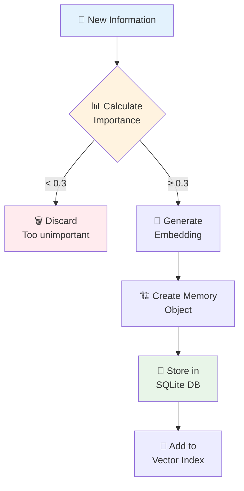
```mermaid
flowchart TD
    Input[📝 New Information] --> Importance{📊 Calculate<br/>Importance}
    
    Importance -->|< 0.3| Discard[🗑️ Discard<br/>Too unimportant]
    Importance -->|≥ 0.3| Embed[🔢 Generate<br/>Embedding]
    
    Embed --> Create[🏗️ Create Memory<br/>Object]
    Create --> Store[💾 Store in<br/>SQLite DB]
    
    Store --> Index[📇 Add to<br/>Vector Index]
    
    style Input fill:#e3f2fd
    style Importance fill:#fff3e0
    style Discard fill:#ffebee
    style Store fill:#e8f5e8
```

### 2. Memory Retrieval Process

When answering a query, the system:

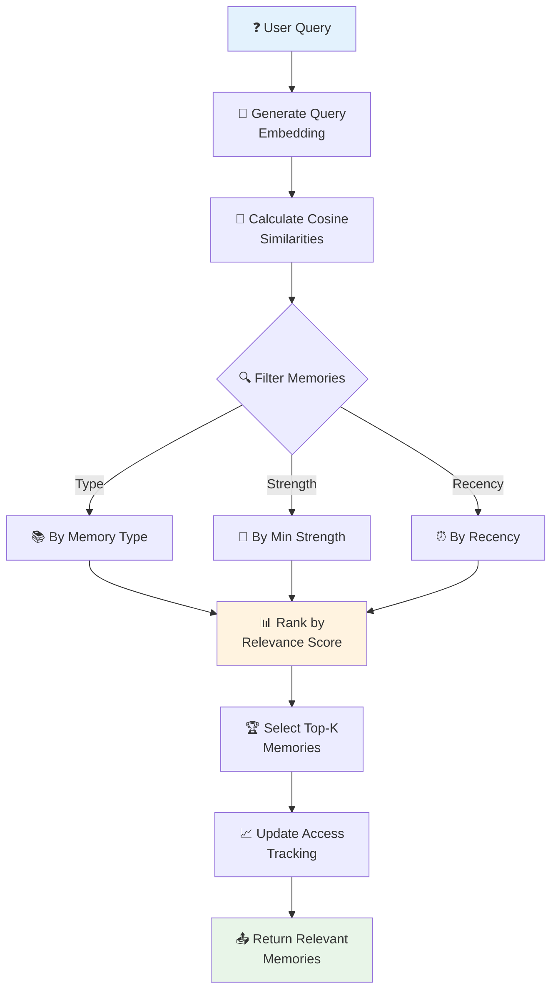
```mermaid
flowchart TD
    Query[❓ User Query] --> QueryEmbed[🔢 Generate Query<br/>Embedding]
    
    QueryEmbed --> Similarity[📐 Calculate Cosine<br/>Similarities]
    
    Similarity --> Filter{🔍 Filter Memories}
    Filter -->|Type| TypeFilter[📚 By Memory Type]
    Filter -->|Strength| StrengthFilter[💪 By Min Strength]
    Filter -->|Recency| RecencyFilter[⏰ By Recency]
    
    TypeFilter --> Rank[📊 Rank by<br/>Relevance Score]
    StrengthFilter --> Rank
    RecencyFilter --> Rank
    
    Rank --> TopK[🏆 Select Top-K<br/>Memories]
    TopK --> Track[📈 Update Access<br/>Tracking]
    
    Track --> Return[📤 Return Relevant<br/>Memories]
    
    style Query fill:#e3f2fd
    style Rank fill:#fff3e0
    style Return fill:#e8f5e8
```

### 3. Memory Integration in RAG

The memory-enhanced RAG process:

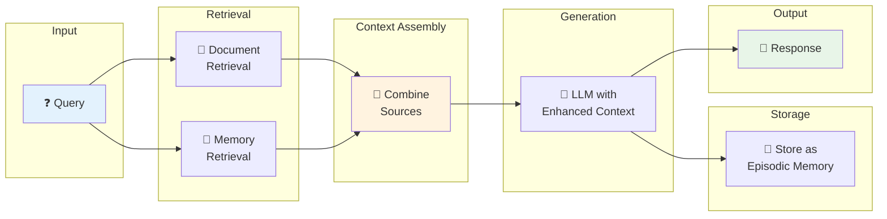
```mermaid
flowchart LR
    subgraph "Input"
        Q[❓ Query]
    end
    
    subgraph "Retrieval"
        DR[📄 Document<br/>Retrieval]
        MR[🧠 Memory<br/>Retrieval]
    end
    
    subgraph "Context Assembly"
        CA[📝 Combine<br/>Sources]
    end
    
    subgraph "Generation"
        LLM[🤖 LLM with<br/>Enhanced Context]
    end
    
    subgraph "Storage"
        MS[💾 Store as<br/>Episodic Memory]
    end
    
    subgraph "Output"
        R[💬 Response]
    end
    
    Q --> DR
    Q --> MR
    
    DR --> CA
    MR --> CA
    
    CA --> LLM
    LLM --> R
    LLM --> MS
    
    style Q fill:#e3f2fd
    style CA fill:#fff3e0
    style R fill:#e8f5e8
```

## Configuration

### System Configuration (`configs/config.yaml`)

```yaml
memory:
  storage_backend: sqlite
  db_path: ../data/memory/ltm.db
  decay_enabled: true                 # Enable memory decay
  decay_rate: 0.01                   # 1% strength loss per day
  consolidation_interval: 86400       # Run consolidation every 24h
  importance_threshold: 0.3           # Minimum importance to store
  max_memories: 10000                # Maximum memories to store

retrieval:
  top_k: 5                           # Documents to retrieve
  memory_k: 3                        # Memories to retrieve
  chunk_size: 1000                   # Document chunk size
  chunk_overlap: 200                 # Overlap between chunks

generation:
  model: "gpt-4"                     # Azure OpenAI model
  temperature: 0.7                   # Response creativity
  max_tokens: 2000                   # Maximum response length
```

### Environment Variables (`.env`)

```bash
# Azure OpenAI Configuration
AZURE_OPENAI_API_KEY=your_api_key_here
AZURE_OPENAI_ENDPOINT=https://your-resource.openai.azure.com/
AZURE_OPENAI_API_VERSION=2024-02-15-preview

# Optional: Custom model deployments
AZURE_OPENAI_DEPLOYMENT_NAME=gpt-4
AZURE_OPENAI_EMBEDDING_DEPLOYMENT=text-embedding-ada-002

# System Configuration
LOG_LEVEL=INFO
MAX_MEMORY_SIZE=10000
CONSOLIDATION_ENABLED=true
```

## API Reference

### 📡 Complete API Endpoints

#### Core Query Endpoints

##### POST `/query` - Query with Memory
Execute a query with document retrieval and memory integration.

**Request:**
```json
{
  "query": "How do I implement caching?",
  "session_id": "user_123",        // Optional: session tracking
  "user_id": "john_doe",            // Optional: user tracking  
  "top_k": 5,                       // Optional: number of docs to retrieve
  "temperature": 0.7,               // Optional: LLM creativity
  "include_sources": true           // Optional: include source documents
}
```

**Response:**
```json
{
  "answer": "You can implement caching in Python using...",
  "sources": [
    {
      "id": 1,
      "content": "Caching strategies include...",
      "score": 0.89,
      "metadata": {"filename": "caching_guide.pdf"}
    }
  ],
  "memories_used": [
    {
      "content": "Q: What's the best caching strategy?\nA: Depends on...",
      "type": "episodic",
      "importance": 0.7,
      "strength": 0.85,
      "created_at": "2025-11-03T10:30:00",
      "access_count": 5
    }
  ],
  "query": "How do I implement caching?",
  "tokens_used": 245,
  "retrieval_time": 0.123,
  "generation_time": 1.456,
  "total_time": 1.579,
  "metadata": {
    "num_sources": 5,
    "num_memories": 2,
    "model": "gpt-4",
    "session_id": "user_123",
    "user_id": "john_doe"
  }
}
```

#### Document Management

##### POST `/documents/upload` - Upload Document
Upload and index a document (PDF, TXT, MD).

**Request:**
```bash
curl -X POST http://localhost:8000/documents/upload \
  -F "file=@document.pdf"
```

**Response:**
```json
{
  "status": "success",
  "filename": "document.pdf",
  "file_path": "/data/documents/document.pdf",
  "size": 15234,
  "file_type": ".pdf",
  "processing_time": 0.234,
  "indexing_time": 1.456,
  "total_time": 1.690
}
```

##### POST `/documents/add` - Add Text Document
Add document from raw text.

**Request:**
```json
{
  "text": "Your document content here...",
  "doc_id": "my_document",
  "metadata": {
    "source": "user_input",
    "category": "notes"
  }
}
```

##### GET `/documents/list` - List Documents
Get all indexed documents.

**Response:**
```json
{
  "count": 10,
  "documents": [
    {
      "doc_id": "document.pdf",
      "metadata": {"filename": "document.pdf", "file_type": ".pdf"}
    }
  ]
}
```

##### GET `/documents/stats` - Document Statistics
Get vector store statistics.

##### DELETE `/documents/clear` - Clear All Documents
Remove all documents from vector store.

#### Memory Management

##### POST `/memory/fact` - Add Semantic Fact
Store an important fact in long-term memory.

**Request:**
```json
{
  "fact": "The API rate limit is 1000 requests per hour",
  "importance": 0.9,
  "tags": ["api", "rate-limit", "production"]
}
```

##### GET `/memory/stats` - Memory Statistics
Get overall memory system statistics.

**Response:**
```json
{
  "total_memories": 150,
  "episodic_memories": 100,
  "semantic_memories": 50,
  "average_importance": 0.65,
  "average_strength": 0.78
}
```

##### GET `/memory/search` - Search Memories
Search memories semantically.

**Query Parameters:**
- `query`: Search query string
- `k`: Number of results (default: 5)
- `memory_type`: Filter by type (episodic/semantic/procedural)

**Response:**
```json
{
  "query": "caching strategies",
  "count": 3,
  "memories": [
    {
      "content": "Use Redis for distributed caching",
      "type": "semantic",
      "importance": 0.8,
      "strength": 0.9,
      "created_at": "2025-11-01T14:20:00",
      "access_count": 12
    }
  ]
}
```

##### POST `/memory/decay` - Apply Memory Decay
Manually trigger decay process for all memories.

**Response:**
```json
{
  "status": "success",
  "message": "Decay applied to all memories",
  "total_memories": 150,
  "updated_count": 145,
  "weakened_count": 23,
  "decay_enabled": true,
  "decay_rate": 0.01
}
```

##### DELETE `/memory/clear` - Clear All Memories
Remove all memories from the system.

#### Session Management

##### GET `/sessions` - List Sessions
Get all conversation sessions.

**Query Parameters:**
- `user_id`: Filter by specific user (optional)

**Response:**
```json
{
  "count": 5,
  "sessions": [
    {
      "session_id": "session_123",
      "user_id": "john_doe",
      "created_at": "2025-11-01T10:00:00",
      "last_active": "2025-11-03T15:30:00",
      "memory_count": 25
    }
  ]
}
```

##### GET `/sessions/{session_id}/memories` - Session Memories
Get all memories for a specific session.

**Query Parameters:**
- `memory_type`: Filter by type (optional)
- `limit`: Maximum number of results (optional)

##### GET `/sessions/{session_id}/stats` - Session Statistics
Get statistics for a specific session.

##### GET `/sessions/{session_id}/timeline` - Session Timeline
Get chronological conversation timeline.

##### GET `/sessions/{session_id}/frequent-topics` - Frequent Topics
Get most discussed topics in a session.

**Query Parameters:**
- `top_n`: Number of topics to return (default: 10)

##### GET `/sessions/{session_id}/patterns` - Query Patterns
Get query patterns and analytics for a session.

##### DELETE `/sessions/{session_id}/memories` - Clear Session
Clear all memories for a specific session.

**Query Parameters:**
- `memory_type`: Only clear specific type (optional)

#### User Management

##### GET `/users` - List Users
Get all unique users in the system.

**Response:**
```json
{
  "count": 3,
  "users": ["john_doe", "jane_smith", "bob_jones"]
}
```

##### GET `/users/{user_id}/memories` - User Memories
Get all memories for a specific user across all sessions.

##### GET `/users/{user_id}/stats` - User Statistics
Get detailed statistics for a user.

**Response:**
```json
{
  "user_id": "john_doe",
  "total_memories": 125,
  "total_sessions": 8,
  "episodic_count": 85,
  "semantic_count": 40,
  "average_importance": 0.68,
  "most_active_session": "session_123",
  "first_interaction": "2025-10-15T09:00:00",
  "last_interaction": "2025-11-16T14:30:00"
}
```

##### GET `/users/{user_id}/frequent-topics` - User Topics
Get most frequently discussed topics for a user.

##### GET `/users/{user_id}/patterns` - User Patterns
Get query patterns across all user sessions.

##### DELETE `/users/{user_id}/memories` - Clear User Data
Remove all memories for a user.

#### System Health

##### GET `/` - API Info
Get basic API information.

**Response:**
```json
{
  "name": "RAG with Long-Term Memory API",
  "version": "1.0.0",
  "status": "running",
  "supported_file_types": [".pdf", ".txt", ".md"]
}
```

##### GET `/health` - Health Check
Check system health status.

**Response:**
```json
{
  "status": "healthy",
  "memory_count": 150,
  "pipeline_ready": true
}
```

#### Migration

##### POST `/memory/migrate` - Migrate Memory Data
Migrate existing memory data to extract session_id and user_id from metadata.

**Response:**
```json
{
  "status": "success",
  "message": "Data migration completed",
  "updated_count": 150
}
```

### 🔐 API Authentication (Coming Soon)

Future versions will include:
- API key authentication
- Rate limiting per user
- Role-based access control

## Architecture Deep Dive

### Memory Storage Architecture

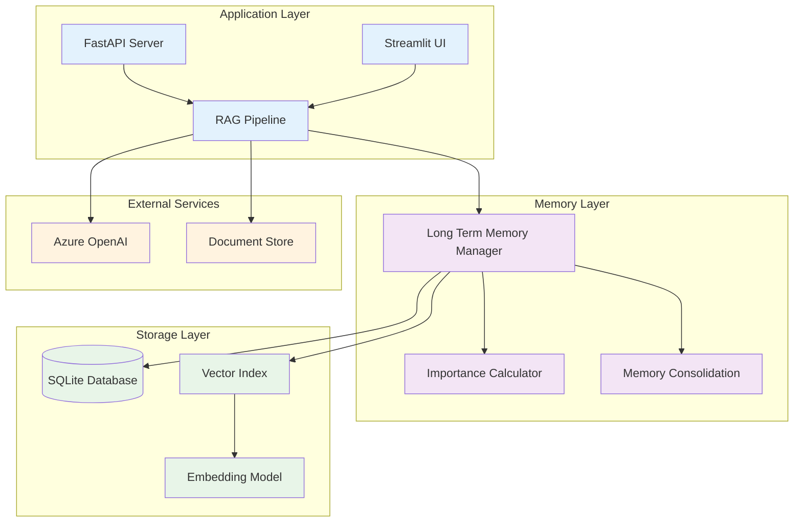
```mermaid
graph TB
    subgraph "Application Layer"
        API[FastAPI Server]
        UI[Streamlit UI]
        Pipeline[RAG Pipeline]
    end
    
    subgraph "Memory Layer"
        LTM[Long Term Memory Manager]
        IC[Importance Calculator]
        MC[Memory Consolidation]
    end
    
    subgraph "Storage Layer"
        SQLite[(SQLite Database)]
        VectorIndex[Vector Index]
        Embeddings[Embedding Model]
    end
    
    subgraph "External Services"
        Azure[Azure OpenAI]
        Docs[Document Store]
    end
    
    API --> Pipeline
    UI --> Pipeline
    Pipeline --> LTM
    
    LTM --> IC
    LTM --> MC
    LTM --> SQLite
    LTM --> VectorIndex
    
    VectorIndex --> Embeddings
    Pipeline --> Azure
    Pipeline --> Docs
    
    classDef app fill:#e3f2fd
    classDef memory fill:#f3e5f5
    classDef storage fill:#e8f5e8
    classDef external fill:#fff3e0
    
    class API,UI,Pipeline app
    class LTM,IC,MC memory
    class SQLite,VectorIndex,Embeddings storage
    class Azure,Docs external
```

### Data Flow Architecture

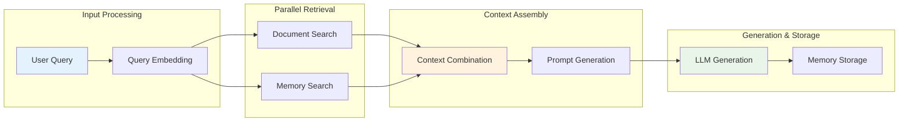
```mermaid
graph LR
    subgraph "Input Processing"
        Query[User Query]
        Embed1[Query Embedding]
    end
    
    subgraph "Parallel Retrieval"
        DocSearch[Document Search]
        MemSearch[Memory Search]
    end
    
    subgraph "Context Assembly"
        Combine[Context Combination]
        Prompt[Prompt Generation]
    end
    
    subgraph "Generation & Storage"
        Generate[LLM Generation]
        Store[Memory Storage]
    end
    
    Query --> Embed1
    Embed1 --> DocSearch
    Embed1 --> MemSearch
    
    DocSearch --> Combine
    MemSearch --> Combine
    
    Combine --> Prompt
    Prompt --> Generate
    Generate --> Store
    
    style Query fill:#e3f2fd
    style Combine fill:#fff3e0
    style Generate fill:#e8f5e8
```

## Performance & Scaling

### Memory System Performance

- **Storage**: SQLite handles millions of memories efficiently
- **Retrieval**: Vector similarity search typically < 100ms
- **Consolidation**: Background process, doesn't block queries
- **Memory Usage**: ~1MB per 1000 memories (including embeddings)

### Optimization Tips

1. **Batch Operations**: Use batch embedding for multiple memories
2. **Index Management**: Regularly rebuild vector indices for large datasets
3. **Memory Limits**: Set appropriate `max_memories` based on available RAM
4. **Consolidation Frequency**: Adjust based on usage patterns

### Scaling Considerations

For production deployments:

- **Database**: Consider PostgreSQL for multi-user scenarios
- **Vector Search**: Use dedicated vector databases (Pinecone, Weaviate)
- **Caching**: Add Redis for frequently accessed memories
- **Load Balancing**: Distribute memory operations across instances

## Troubleshooting

### Common Issues & Solutions

#### 1. Database Locked Errors

**Symptom:**
```json
{"detail": "database is locked"}
```

**Cause:** Multiple concurrent connections to SQLite database.

**Solution:**
```bash
# Remove old database
rm -rf data/memory/ltm.db*

# Restart the server
./run.sh
```

**Prevention:** The system now uses optimized connection handling with batch operations to prevent this.

#### 2. High Memory Usage

**Symptom:** System consuming too much RAM.

**Solutions:**
```yaml
# config.yaml - Reduce memory footprint
memory:
  max_memories: 5000              # Reduce from 10000
  importance_threshold: 0.5       # Increase from 0.3
  
retrieval:
  memory_k: 2                     # Reduce from 3
  top_k: 3                        # Reduce from 5
```

**Check current usage:**
```bash
curl http://localhost:8000/memory/stats
# If total_memories is very high, apply decay:
curl -X POST http://localhost:8000/memory/decay
```

#### 3. Slow Memory Retrieval

**Symptom:** Queries taking > 2 seconds.

**Diagnosis:**
```bash
# Check response times
curl -X POST http://localhost:8000/query \
  -H "Content-Type: application/json" \
  -d '{"query": "test"}' \
  | jq '.retrieval_time, .generation_time'
```

**Solutions:**
- Reduce `memory_k` and `top_k` in config
- Clear old, weak memories: `POST /memory/decay`
- Rebuild vector index for large datasets

#### 4. Memory Not Being Stored

**Symptom:** `total_memories` not increasing after queries.

**Check importance threshold:**
```bash
# View current stats
curl http://localhost:8000/memory/stats

# Lower the threshold in config.yaml
importance_threshold: 0.2  # Was 0.3
```

**Manually store important facts:**
```bash
curl -X POST http://localhost:8000/memory/fact \
  -H "Content-Type: application/json" \
  -d '{
    "fact": "Important information to remember",
    "importance": 0.9
  }'
```

#### 5. Old Memories Not Decaying

**Symptom:** Very old memories still showing up with high strength.

**Check decay settings:**
```yaml
# config.yaml
memory:
  decay_enabled: true     # Must be true
  decay_rate: 0.01        # 1% per day
```

**Manually apply decay:**
```bash
curl -X POST http://localhost:8000/memory/decay
```

#### 6. Document Upload Failures

**Symptom:**
```json
{"detail": "No text could be extracted from the file"}
```

**Solutions:**
- Check file format (only PDF, TXT, MD supported)
- Verify file is not corrupted
- Check file size (very large PDFs may timeout)

**Supported formats:**
```python
from src.retrieval.document_processor import DocumentProcessor
print(DocumentProcessor.get_supported_extensions())
# Output: ['.pdf', '.txt', '.md']
```

#### 7. API Connection Errors

**Symptom:** `Connection refused` or `504 Gateway Timeout`

**Check server status:**
```bash
# Is server running?
curl http://localhost:8000/health

# Check logs
tail -f logs/app.log  # If logging is enabled

# Restart server
./run.sh
```

#### 8. Azure OpenAI Errors

**Symptom:**
```
OpenAI API error: Invalid API key
```

**Verify configuration:**
```bash
# Check .env file
cat .env | grep AZURE_OPENAI

# Required variables:
AZURE_OPENAI_API_KEY=your_key_here
AZURE_OPENAI_ENDPOINT=https://your-resource.openai.azure.com/
AZURE_OPENAI_API_VERSION=2024-02-15-preview
```

**Test connection:**
```python
from src.generation.azure_openai_llm import AzureOpenAILLM
from dotenv import load_dotenv

load_dotenv()
llm = AzureOpenAILLM()
response = llm.generate("Test query")
print(response.content)
```

### Debug Mode

Enable detailed logging for troubleshooting:

```bash
# Set environment variable
export LOG_LEVEL=DEBUG

# Or in .env file
echo "LOG_LEVEL=DEBUG" >> .env

# Restart server
./run.sh
```

### Performance Monitoring

Monitor system performance:

```bash
# Memory statistics
curl http://localhost:8000/memory/stats

# Document statistics  
curl http://localhost:8000/documents/stats

# User statistics
curl http://localhost:8000/users/<user_id>/stats

# Session patterns
curl http://localhost:8000/sessions/<session_id>/patterns
```

### Clearing Data for Fresh Start

```bash
# Clear all memories
curl -X DELETE http://localhost:8000/memory/clear

# Clear all documents
curl -X DELETE http://localhost:8000/documents/clear

# Or manually delete data
rm -rf data/memory/ltm.db*
rm -rf data/embeddings/faiss/*
rm -rf data/documents/*

# Restart server
./run.sh
```

## Contributing

We welcome contributions! Here's how you can help:

### Code Contributions

1. Fork the repository
2. Create a feature branch: `git checkout -b feature/amazing-feature`
3. Make your changes and add tests
4. Run tests: `pytest tests/`
5. Commit changes: `git commit -m 'Add amazing feature'`
6. Push to branch: `git push origin feature/amazing-feature`
7. Open a Pull Request

### Documentation Contributions

**Help us improve documentation by adding screenshots!**

We need screenshots for:
- Document upload interface
- Chat/conversation interface
- Memory dashboard
- Analytics page
- Memory search interface

See [images/README.md](images/README.md) for detailed instructions on what screenshots are needed and how to capture them.

**To contribute screenshots:**
1. Run the application locally
2. Capture high-quality screenshots (1920x1080 or 1440x900)
3. Save them in `images/` directory with the specified filenames
4. Submit a PR with the new screenshots

### Development Setup

```bash
# Install development dependencies
pip install -r requirements-dev.txt

# Run tests with coverage
pytest tests/ --cov=src --cov-report=html

# Run type checking
mypy src/

# Format code
black src/ tests/
isort src/ tests/

# Run linting
flake8 src/ tests/
```

### Testing Your Changes

```bash
# Run all tests
pytest tests/ -v

# Run specific test file
pytest tests/test_document_upload.py -v

# Run with coverage
pytest tests/ --cov=src --cov-report=term-missing

# Test the API
python -m pytest tests/ -k "test_api"
```

### Code Style Guidelines

- Follow PEP 8 style guide
- Use type hints for function signatures
- Write docstrings for all public methods
- Keep functions small and focused
- Add unit tests for new features

## 🗺️ Roadmap

### Current Version (v1.0)
- ✅ RAG with FAISS/Chroma vector stores
- ✅ Long-term memory with SQLite
- ✅ Three memory types (episodic, semantic, procedural)
- ✅ Memory decay and consolidation
- ✅ FastAPI REST API
- ✅ Streamlit web interface
- ✅ Session and user management
- ✅ Memory analytics and insights
- ✅ Document upload (PDF, TXT, MD)
- ✅ Batch memory operations
- ✅ Comprehensive API documentation

### Upcoming Features (v1.1)
- ⏳ Enhanced Streamlit UI with charts
- ⏳ Memory visualization graphs
- ⏳ Export/import memory data
- ⏳ Advanced search filters
- ⏳ Memory tagging and categorization

### Future Enhancements (v2.0)
- 🔮 Multi-user authentication
- 🔮 PostgreSQL support for production
- 🔮 Distributed vector search (Pinecone, Weaviate)
- 🔮 Redis caching layer
- 🔮 Webhook notifications
- 🔮 GraphQL API
- 🔮 Docker deployment
- 🔮 Kubernetes manifests
- 🔮 Memory clustering and relationships
- 🔮 Advanced analytics dashboards

### Research & Experimental
- 🧪 Active learning from user feedback
- 🧪 Memory merging and deduplication
- 🧪 Automatic knowledge graph construction
- 🧪 Multi-modal memory (images, audio)
- 🧪 Federated learning for privacy

## 📚 Additional Resources

### Documentation
- **[Quick Start Guide](QUICKSTART.md)** - Get up and running in 5 minutes
- **[Long-Term Memory Guide](LONG_TERM_MEMORY_GUIDE.md)** - Deep dive into memory system
- **[Memory Dashboard Implementation](MEMORY_DASHBOARD_IMPLEMENTATION.md)** - UI/UX documentation
- **[Project Completion Status](PROJECT_COMPLETE.md)** - Implementation checklist

### API Documentation
- **Interactive API Docs**: http://localhost:8000/docs (when server is running)
- **ReDoc**: http://localhost:8000/redoc (alternative API documentation)

### Example Notebooks
Check the `notebooks/` directory (coming soon) for:
- Memory system exploration
- Performance benchmarking
- Custom retrieval strategies
- Advanced use cases

### Community
- **Issues**: Report bugs or request features on GitHub Issues
- **Discussions**: Join conversations on GitHub Discussions
- **Wiki**: Community-contributed guides and tips

## 🎓 Learn More

### Papers & Research
This project is inspired by:
- *Retrieval-Augmented Generation for Knowledge-Intensive NLP Tasks* (Lewis et al., 2020)
- *Memory Networks* (Weston et al., 2014)
- *Long Short-Term Memory* (Hochreiter & Schmidhuber, 1997)
- *The Adaptive Character of Thought* (Anderson, 1990)

### Related Projects
- **LangChain**: Framework for LLM applications
- **LlamaIndex**: Data framework for LLM applications
- **Mem0**: Memory layer for AI applications
- **ChromaDB**: AI-native vector database
- **FAISS**: Facebook AI Similarity Search

## 💡 Use Cases

### Software Development
- Code review assistant that remembers your coding style
- Documentation chatbot with project context
- Bug tracking with historical issue memory

### Customer Support
- Support agent with customer interaction history
- FAQ bot that learns from conversations
- Ticket resolution with similar case memory

### Education
- Personalized tutoring with student progress tracking
- Study assistant that remembers learning patterns
- Course material Q&A with context retention

### Research
- Literature review assistant with paper summaries
- Experiment tracking with methodology memory
- Research notes organization with semantic search

### Personal Knowledge Management
- Second brain for personal notes and ideas
- Meeting notes with action item tracking
- Journal analysis with insight extraction

## License

MIT License - see [LICENSE](LICENSE) file for details.

## Citation

If you use this project in your research, please cite:

```bibtex
@software{rag_ltm_2025,
  title={RAG with Long-Term Memory: Persistent Context for AI Conversations},
  author={Your Name},
  year={2025},
  url={https://github.com/yourusername/rag_ltm}
}
```

---

**📚 For detailed implementation guide, see [LONG_TERM_MEMORY_GUIDE.md](LONG_TERM_MEMORY_GUIDE.md)**

**🚀 For quick start tutorial, see [QUICKSTART.md](QUICKSTART.md)**
