# RAG with Long-Term Memory

A Retrieval-Augmented Generation system with persistent long-term memory capabilities, enabling contextual conversations that remember past interactions and build knowledge over time.

## Architecture Overview

The system combines traditional RAG (Retrieval-Augmented Generation) with a sophisticated long-term memory system that persists knowledge across sessions.

```mermaid
graph TB
    User[👤 User Query] --> Pipeline[🧠 RAG with Memory Pipeline]
    
    Pipeline --> DocRet[📄 Document Retrieval]
    Pipeline --> MemRet[🧠 Memory Retrieval]
    Pipeline --> Context[📝 Context Assembly]
    
    DocRet --> VectorDB[(🗃️ Vector Store<br/>FAISS/Chroma)]
    MemRet --> MemoryDB[(💾 Memory Store<br/>SQLite)]
    
    VectorDB --> Context
    MemoryDB --> Context
    
    Context --> LLM[🤖 LLM Generation<br/>Azure OpenAI GPT-4]
    LLM --> Response[💬 Response]
    
    Response --> MemStore[💾 Store Interaction<br/>as Episodic Memory]
    MemStore --> MemoryDB
    
    classDef userNode fill:#e1f5fe
    classDef processNode fill:#f3e5f5
    classDef storageNode fill:#e8f5e8
    classDef llmNode fill:#fff3e0
    
    class User userNode
    class Pipeline,DocRet,MemRet,Context,MemStore processNode
    class VectorDB,MemoryDB storageNode
    class LLM,Response llmNode
```



## Memory System Architecture

The long-term memory system is designed around three types of memory, inspired by cognitive science:


## Detailed System Flow

Here's how a query flows through the entire system:


## Features

- **🔍 Hybrid Retrieval**: Vector-based document retrieval using FAISS/Chroma combined with semantic memory search
- **🧠 Long-Term Memory**: Persistent memory with three types (episodic, semantic, procedural)
- **⚖️ Importance Scoring**: Automatic assessment of memory importance for selective storage
- **📉 Memory Decay**: Natural forgetting process with consolidation of important memories
- **🤖 LLM Integration**: Azure OpenAI GPT-4 with memory-enhanced prompts
- **🚀 FastAPI Backend**: RESTful API for integration
- **🎨 Streamlit Interface**: User-friendly web interface
- **📊 Memory Analytics**: Statistics and insights into memory usage

## Quick Start

### Prerequisites
- Python 3.8+
- Azure OpenAI API key
- At least 4GB RAM (for embeddings and vector operations)

### Installation

1. **Clone and Setup Environment**
   ```bash
   git clone <repository-url>
   cd rag_ltm
   python -m venv venv
   source venv/bin/activate  # On Windows: venv\Scripts\activate
   pip install -r requirements.txt
   ```

2. **Configure API Keys**
   ```bash
   cp .env.example .env
   # Edit .env with your Azure OpenAI credentials:
   # AZURE_OPENAI_API_KEY=your_api_key_here
   # AZURE_OPENAI_ENDPOINT=your_endpoint_here
   ```

3. **Initialize System**
   ```bash
   # Setup directories and initialize databases
   chmod +x setup.sh
   ./setup.sh
   ```

4. **Run the System**
   ```bash
   # Option 1: Run both API and UI
   chmod +x run.sh
   ./run.sh
   
   # Option 2: Run separately
   # Terminal 1 - API Server
   uvicorn src.api.main:app --reload --port 8000
   
   # Terminal 2 - Streamlit UI
   streamlit run src.ui/streamlit_app.py --server.port 8501
   ```

5. **Access the Interface**
   - Web UI: http://localhost:8501
   - API Documentation: http://localhost:8000/docs

## Usage Examples

### Basic Conversation with Memory

```python
from src.pipeline.rag_with_memory import RAGWithMemory
from src.memory.long_term_memory import LongTermMemory

# Initialize the system
pipeline = RAGWithMemory(...)

# First interaction
response1 = pipeline.query(
    "I'm working on a Python web scraping project using BeautifulSoup",
    session_id="user_123"
)

# Later interaction - system remembers context
response2 = pipeline.query(
    "What was I working on earlier?",
    session_id="user_123"
)
# Response will reference the web scraping project from memory
```

### Adding Important Facts

```python
# Store important information that should be remembered
pipeline.add_fact(
    fact="The production API rate limit is 1000 requests per hour",
    importance=0.9,
    tags=["api", "production", "rate-limit"]
)

# Later queries about APIs will retrieve this fact
response = pipeline.query("What's the API rate limit?")
```

### Memory Statistics

```python
# Check memory system health
stats = pipeline.get_memory_stats()
print(f"Total memories: {stats['total_memories']}")
print(f"Average importance: {stats['average_importance']:.2f}")
```

## Memory System Features

### 🧠 Three Types of Memory

| Type | Purpose | Examples | Retention |
|------|---------|----------|-----------|
| **Episodic** | Conversations & Events | "User asked about caching yesterday" | Session-based, decays |
| **Semantic** | Facts & Knowledge | "User prefers tabs over spaces" | Long-term, high importance |
| **Procedural** | How-to Knowledge | "Steps for deployment process" | Workflow-based |

### 📊 Importance Scoring

The system automatically calculates importance based on:
- **Content Analysis**: Keywords like "important", "remember", "always"
- **User Signals**: Explicitly marked information
- **Context**: Source type and metadata
- **Length**: Detailed content vs. brief mentions

### 🔄 Memory Consolidation

- **Decay Process**: Unused memories gradually weaken
- **Strengthening**: Frequently accessed memories become stronger
- **Cleanup**: Very weak memories are automatically removed
- **Protection**: High-importance memories resist decay

### 🔍 Smart Retrieval

- **Semantic Search**: Uses vector embeddings for contextual matching
- **Multi-factor Ranking**: Combines similarity, importance, and recency
- **Type Filtering**: Can focus on specific memory types
- **Strength Threshold**: Ignores very weak/old memories

## Long-Term Memory Components

### Memory Types & Structure


### Memory Lifecycle


## Project Structure

```
rag_ltm/
├── src/
│   ├── retrieval/          # Vector store and document retrieval
│   │   ├── chroma_store.py     # ChromaDB integration
│   │   ├── faiss_store.py      # FAISS vector store
│   │   ├── embeddings.py       # Text embedding generation
│   │   └── retriever.py        # Document retrieval logic
│   ├── generation/         # LLM integration
│   │   ├── azure_openai_llm.py # Azure OpenAI wrapper
│   │   ├── llm_manager.py      # LLM orchestration
│   │   └── prompts.py          # Prompt templates
│   ├── memory/             # Long-term memory system ⭐
│   │   ├── memory_types.py     # Memory data models
│   │   ├── memory_store.py     # SQLite storage layer
│   │   ├── long_term_memory.py # Memory manager
│   │   └── importance_calculator.py # Importance scoring
│   ├── pipeline/           # RAG pipeline orchestration
│   │   ├── rag_pipeline.py     # Base RAG implementation
│   │   └── rag_with_memory.py  # Memory-enhanced RAG ⭐
│   ├── api/               # FastAPI backend
│   │   └── main.py            # REST API endpoints
│   └── ui/                # Streamlit frontend
│       └── streamlit_app.py   # Web interface
├── tests/                 # Test suite
├── configs/               # Configuration files
│   └── config.yaml           # System configuration
├── data/                  # Data storage
│   ├── documents/            # Source documents
│   ├── embeddings/           # Vector embeddings
│   └── memory/               # Memory database ⭐
└── notebooks/             # Exploration notebooks
```

## How Long-Term Memory Works

### 1. Memory Storage Process

When new information is encountered, the system:

```mermaid
flowchart TD
    Input[📝 New Information] --> Importance{📊 Calculate<br/>Importance}
    
    Importance -->|< 0.3| Discard[🗑️ Discard<br/>Too unimportant]
    Importance -->|≥ 0.3| Embed[🔢 Generate<br/>Embedding]
    
    Embed --> Create[🏗️ Create Memory<br/>Object]
    Create --> Store[💾 Store in<br/>SQLite DB]
    
    Store --> Index[📇 Add to<br/>Vector Index]
    
    style Input fill:#e3f2fd
    style Importance fill:#fff3e0
    style Discard fill:#ffebee
    style Store fill:#e8f5e8
```



### 2. Memory Retrieval Process

When answering a query, the system:

```mermaid
flowchart TD
    Query[❓ User Query] --> QueryEmbed[🔢 Generate Query<br/>Embedding]
    
    QueryEmbed --> Similarity[📐 Calculate Cosine<br/>Similarities]
    
    Similarity --> Filter{🔍 Filter Memories}
    Filter -->|Type| TypeFilter[📚 By Memory Type]
    Filter -->|Strength| StrengthFilter[💪 By Min Strength]
    Filter -->|Recency| RecencyFilter[⏰ By Recency]
    
    TypeFilter --> Rank[📊 Rank by<br/>Relevance Score]
    StrengthFilter --> Rank
    RecencyFilter --> Rank
    
    Rank --> TopK[🏆 Select Top-K<br/>Memories]
    TopK --> Track[📈 Update Access<br/>Tracking]
    
    Track --> Return[📤 Return Relevant<br/>Memories]
    
    style Query fill:#e3f2fd
    style Rank fill:#fff3e0
    style Return fill:#e8f5e8
```



### 3. Memory Integration in RAG

The memory-enhanced RAG process:

```mermaid
flowchart LR
    subgraph "Input"
        Q[❓ Query]
    end
    
    subgraph "Retrieval"
        DR[📄 Document<br/>Retrieval]
        MR[🧠 Memory<br/>Retrieval]
    end
    
    subgraph "Context Assembly"
        CA[📝 Combine<br/>Sources]
    end
    
    subgraph "Generation"
        LLM[🤖 LLM with<br/>Enhanced Context]
    end
    
    subgraph "Storage"
        MS[💾 Store as<br/>Episodic Memory]
    end
    
    subgraph "Output"
        R[💬 Response]
    end
    
    Q --> DR
    Q --> MR
    
    DR --> CA
    MR --> CA
    
    CA --> LLM
    LLM --> R
    LLM --> MS
    
    style Q fill:#e3f2fd
    style CA fill:#fff3e0
    style R fill:#e8f5e8
```



## Configuration

### System Configuration (`configs/config.yaml`)

```yaml
memory:
  storage_backend: sqlite
  db_path: ../data/memory/ltm.db
  decay_enabled: true                 # Enable memory decay
  decay_rate: 0.01                   # 1% strength loss per day
  consolidation_interval: 86400       # Run consolidation every 24h
  importance_threshold: 0.3           # Minimum importance to store
  max_memories: 10000                # Maximum memories to store

retrieval:
  top_k: 5                           # Documents to retrieve
  memory_k: 3                        # Memories to retrieve
  chunk_size: 1000                   # Document chunk size
  chunk_overlap: 200                 # Overlap between chunks

generation:
  model: "gpt-4"                     # Azure OpenAI model
  temperature: 0.7                   # Response creativity
  max_tokens: 2000                   # Maximum response length
```

### Environment Variables (`.env`)

```bash
# Azure OpenAI Configuration
AZURE_OPENAI_API_KEY=your_api_key_here
AZURE_OPENAI_ENDPOINT=https://your-resource.openai.azure.com/
AZURE_OPENAI_API_VERSION=2024-02-15-preview

# Optional: Custom model deployments
AZURE_OPENAI_DEPLOYMENT_NAME=gpt-4
AZURE_OPENAI_EMBEDDING_DEPLOYMENT=text-embedding-ada-002

# System Configuration
LOG_LEVEL=INFO
MAX_MEMORY_SIZE=10000
CONSOLIDATION_ENABLED=true
```

## API Reference

### REST API Endpoints

The FastAPI backend provides these endpoints:

#### Query with Memory
```http
POST /query
Content-Type: application/json

{
    "query": "How do I implement caching in Python?",
    "session_id": "user_123",
    "include_memory": true,
    "store_interaction": true
}
```

**Response:**
```json
{
    "answer": "You can implement caching in Python using...",
    "sources": [...],
    "memories_used": [
        {
            "content": "Q: What's the best caching strategy?\nA: It depends on...",
            "type": "episodic",
            "importance": 0.7,
            "created_at": "2025-11-03T10:30:00"
        }
    ],
    "tokens_used": 150,
    "total_time": 1.2
}
```

#### Add Fact
```http
POST /memory/fact
Content-Type: application/json

{
    "fact": "The API rate limit is 1000 requests per hour",
    "importance": 0.9,
    "tags": ["api", "rate-limit"]
}
```

#### Memory Statistics
```http
GET /memory/stats
```

**Response:**
```json
{
    "total_memories": 150,
    "episodic_memories": 100,
    "semantic_memories": 50,
    "average_importance": 0.65,
    "average_strength": 0.78
}
```

## Architecture Deep Dive

### Memory Storage Architecture


### Data Flow Architecture


## Performance & Scaling

### Memory System Performance

- **Storage**: SQLite handles millions of memories efficiently
- **Retrieval**: Vector similarity search typically < 100ms
- **Consolidation**: Background process, doesn't block queries
- **Memory Usage**: ~1MB per 1000 memories (including embeddings)

### Optimization Tips

1. **Batch Operations**: Use batch embedding for multiple memories
2. **Index Management**: Regularly rebuild vector indices for large datasets
3. **Memory Limits**: Set appropriate `max_memories` based on available RAM
4. **Consolidation Frequency**: Adjust based on usage patterns

### Scaling Considerations

For production deployments:

- **Database**: Consider PostgreSQL for multi-user scenarios
- **Vector Search**: Use dedicated vector databases (Pinecone, Weaviate)
- **Caching**: Add Redis for frequently accessed memories
- **Load Balancing**: Distribute memory operations across instances

## Troubleshooting

### Common Issues

1. **High Memory Usage**
   - Reduce `max_memories` in config
   - Increase `importance_threshold`
   - Enable more aggressive consolidation

2. **Slow Memory Retrieval**
   - Check vector index size
   - Reduce `memory_k` parameter
   - Consider approximate search methods

3. **Memory Not Being Stored**
   - Check `importance_threshold` setting
   - Verify importance calculation logic
   - Review memory content for importance keywords

4. **Old Memories Not Decaying**
   - Ensure `decay_enabled: true`
   - Check `consolidation_interval`
   - Verify memory access tracking

### Debug Mode

```bash
# Enable verbose logging
export LOG_LEVEL=DEBUG

# Run with memory debugging
python -m src.memory.debug_memory
```

## Contributing

1. Fork the repository
2. Create a feature branch: `git checkout -b feature/amazing-feature`
3. Make your changes and add tests
4. Run tests: `pytest tests/`
5. Commit changes: `git commit -m 'Add amazing feature'`
6. Push to branch: `git push origin feature/amazing-feature`
7. Open a Pull Request

### Development Setup

```bash
# Install development dependencies
pip install -r requirements-dev.txt

# Run tests with coverage
pytest tests/ --cov=src --cov-report=html

# Run type checking
mypy src/

# Format code
black src/ tests/
isort src/ tests/
```

## License

MIT License - see [LICENSE](LICENSE) file for details.

## Citation

If you use this project in your research, please cite:

```bibtex
@software{rag_ltm_2025,
  title={RAG with Long-Term Memory: Persistent Context for AI Conversations},
  author={Your Name},
  year={2025},
  url={https://github.com/yourusername/rag_ltm}
}
```

---

**📚 For detailed implementation guide, see [LONG_TERM_MEMORY_GUIDE.md](LONG_TERM_MEMORY_GUIDE.md)**

**🚀 For quick start tutorial, see [QUICKSTART.md](QUICKSTART.md)**
